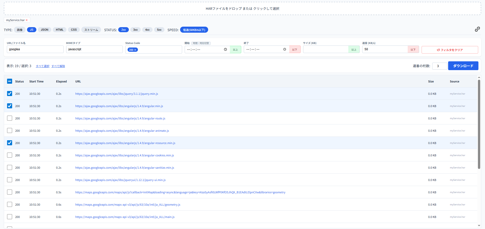

# HAR Pick

**HARファイルからコンテンツを効率的に抽出。**

[>> 使ってみる](https://alumina.me/harpick/)

HARファイルから動画, 画像, API等のレスポンスを特定しコンテンツを抽出するWEB上の抽出専用ツールです。
URLやMIME, 通信時間等のさまざまな条件から絞り込みができます。

読み込ませたデータはサーバーを一切経由せず、ブラウザ上で完結するため安心・安全です！

## 機能

- **検索フィルタ**:
	- 使用頻度の高いフィルタはプリセットボタンを押すだけで検索フィルタへ反映。
	- URL検索ではワイルドカードやor検索(スペース区切り)に対応。
	- 時刻表示（時計/経過秒数）のワンタッチ切り替え。
	- 選択したアイテムの一括ダウンロード。
- **検索フィルタ共有**
	- 検索フィルタをそのままに他の人に共有可能。
- **アイテム選択**
	- Shift + クリックによる範囲選択に対応。
	- URLクリックでそのままジャンプします。
- **プライバシー保護**
	すべての処理はブラウザ内で完結するため、サーバーにログを送信しません。

## 使い方

1. ブラウザで[alumina.me/harpick/](https://alumina.me/harpick/)にアクセスします。
2. HARファイルを画面にドラッグ&ドロップします。
3. プリセットボタンや検索フィールドを使用して目的のデータを探します。
4. 必要な行を選択し、ダウンロードボタンを押して保存します。
